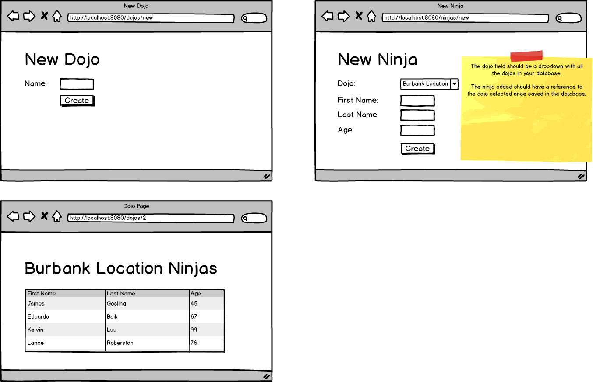

# Java_Dojos_and_Ninjas
A Java application that will keep track of dojos and all the ninjas that are part of a specific dojo.

Tasks:

● Allow users to create a new dojo.

● Allow new ninjas to choose their dojo via a dropdown

● Have a dojo show page show information of all the ninjas that belong to that specific location.

ERD and Wireframe

